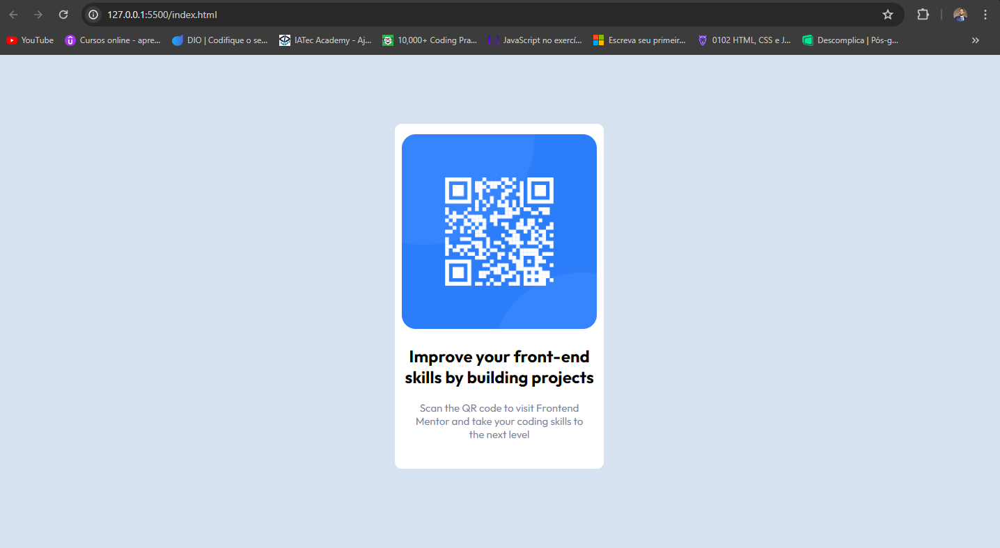

# Frontend Mentor - QR code component solution

This is a solution to the [QR code component challenge on Frontend Mentor](https://www.frontendmentor.io/challenges/qr-code-component-iux_sIO_H). Frontend Mentor challenges help you improve your coding skills by building realistic projects.

## Table of contents

- [Overview](#overview)
  - [Screenshot](#screenshot)
  - [Links](#links)
- [My process](#my-process)
  - [Built with](#built-with)
  - [What I learned](#what-i-learned)
  - [Continued development](#continued-development)
  - [Useful resources](#useful-resources)
- [Author](#author)

## Overview

### Screenshot



### Links

- Solution URL: [Add solution URL here](https://github.com/Weslley-Souza32/QRCode_FronrEnd_Mentor)
- Live Site URL: [Add live site URL here](https://qr-code-front-end-mentor-tan.vercel.app/)

## My process

### Built with

- Semantic HTML5 markup
- CSS custom properties
- Flexbox

### What I learned

Neste desafio eu aprendi sobre o flex e irei aperfeiçoar mais

Sinto orgulho desta parte do css onde consegui colocar meu footer sem o meu container sobre alterações pois antes eu estava dando um padding-top ou um margin-top no footer e o meu container esta subindo para o topo da pagina, e deste jeito q fiz conseguir resolver.

```
.wrapper {
  display: flex;
  flex-direction: column;
  min-height: 100vh;
}
.container {
  max-width: 350px;
  background-color: #fff;
  display: flex;
  flex-direction: column;
  align-items: center;
  padding: 15px 10px 40px 10px;
  border-radius: 10px;
  margin: auto;
}
```

### Continued development

Quero aperfeiçoar mais a utilização dos flex e compreender melhor como utilizar o grid.

### Useful resources

- Este desafio me ajudou muito a enteder melhor o display flex, sobre onde devo colocar o display flex para ter o efeito certo.
- Consegui compreender melhor sobre como usar o max-width para redimensionar minhas larguras.

## Author

- Website - [Add your name here](https://www.your-site.com)
- Frontend Mentor - [@Weslley-Souza32](https://www.frontendmentor.io/profile/yourusername)
